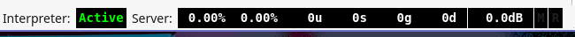

# Supercollider Notes

## Basics

### Hello World
```supercollider
"Hello World".postln;
```
Press Ctrl + Enter to evaluate.

### Server and Language



The interpreter is active by default. The server needs to be enabled.

The server makes sounds. The language (or client/interpreter) is used to control the server.

### Starting/Stopping A Server
#### Boot The server
Ctrl + B

### Making Sounds
#### Boring Sine Wave
```supercollider
{SinOSc.ar}.play;
```
#### Changing the Volume
```supercollider
s.volume.gui;
```
#### Stopping Sound
Ctrl + .
#### Goofy Sci-Fi Robot Sound Effect Sine Wave
```supercollider
{SinOsc.ar(LFNoise0.kr(10).range(500, 1500), mul: 0.1)}.play;
```
#### "Geiger Counter"/Space/Arctic Sound
```supercollider
{RLPF.ar(Dust.ar([12,15]), LFNoise1.ar([0.3,0.2]).range(100,3000),0.2)}.play;
```
### Code Blocks
Everything inside the brackets is evaluated.
```supercollider
(
// A little poem
"Today is Sunday".postln;
"Foot of pipe".postln;
"The pipe is made of gold".postln;
"It can beat the bull".postIn;
)
```
As long as the cursor is anywhere within the parenthesis, a single Ctrl+Enter will evaluate all of the lines.
### Recording
```supercollider
// QUICK RECORD
// Start recording:
s.record;
// Make some cool sound
{Saw.ar(LFNoise0.kr([2, 3]).range(100, 2000), LFPulse.kr([4, 5]) * 0.1)}.play;
// Stop recording:
s.stopRecording;
// Optional: GUI with record button, volume control, mute button:
s.makeWindow;
```

