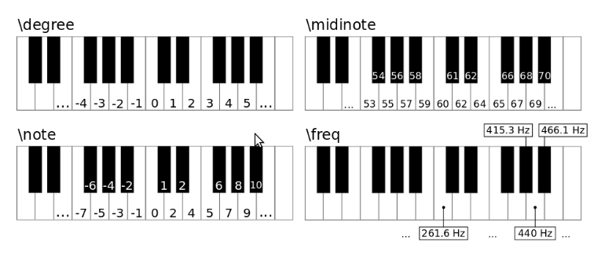

# Patterns

## The Patern Family 👪

### `Pbind`
`Pbind` is a member of the Pattern family in SuperCollider. The capital P in `Pbind` and `Pseries` stands for pattern.
```supercollider
Pbind(\degree, 0).play;
```
This plays the note middle C once per second. `\degree` refers to scale degrees, and the number 0 means the first scale degree.

White keys to the right or left of middle C can be selected by using positive or negative numbers.

#### `Pbind` Duration
```supercollider
Pbind(\degree, 16, \dur, 0.5).play;
```
This plays a note twice in one second?

#### `Pseq` for `\degree` arguments
```supercollider
Pbind(\degree, Pseq([0,1,2,3,4,5,6,7], 1) \dur, 0.5).play;
```
`Pbind` plays several notes in sequence. Its arguments are a list of notes/numbers, and a number of repitions. `Pbind` is
being used as the input for the `\degree` argument in place of a fixed number.

#### `Pseq` for `\dur` arguments
```supercollider
Pbind(\degree, Pseq([0,1,2,3,4,5,6,7], 5) \dur, Pseq([0.2, 0.1, 0.1, 0.2, 0.2, 0.35], inf)).play;
```
- `\degree` argument causes the entire scale to play five times.
- `\dur` argument causes the notes to have the given durations. The duration is infinite, which causes the duration
  array to be cycled. This means that the last two notes will be played with a duration from the first two elements of
  the duration value array.

#### "Readable" Version
```supercollider
(
Pbind(
    \degree, Pseq([0,1,2,3,4,5,6,7], 5) 
    \dur, Pseq([0.2, 0.1, 0.1, 0.2, 0.2, 0.35], inf)
).play;
)
```
#### Specifying Pitch

```supercollider
Pbind(\degree, 1).play;
Pbind(\note, 2).play;
Pbind(\midinote, 69).play;
Pbind(\freq, 440).play;
```
#### `\amp` and `\legato` keywords
- The `\amp` keyword defines the amplitude of events.  
- The `\legato` defines the amount of [legato](https://www.masterclass.com/articles/music-101-what-is-legato-learn-what-effect-legato-has-on-music-and-what-you-need-for-good-legato-technique#how-does-legato-sound-on-various-instruments) between notes.

##### Increasing `\legato` example
```supercollider
(
Pbind(
    \degree, Pseq([0,-1,2,-3,4,-3,7,11,4,2,0,-3], 10),
    \dur, Pseq([0.2, 0.2, 0.2], inf),
    \amp, Pseq([0.7, 0.5, 0.3, 0.2], inf),
    \legato, Pseries(0, 0.1)
).play;
)
```
### `Pwhite`

`Pwhite` is an equal distribution random number generator.

```supercollider
(
Pbind(
    \freq, Pwhite(100, 500), // selects a random number between 100 and 500
    \dur, Prand([0.15, 0.25, 0.3], inf),
    \amp, 0.2,
    \legato, 0.3
).trace.play; // prints out values for every event in the Post window - handy for debugging
)
```
#### `Pwhite` and `Prand` differences

Both have to do with randomness but take in different arguments and do different things.

- `Pwhite(low, high)` selects a random number between `low` and `high`
- `Prand([e1,e2,e3,...])` selects a random element from a list

If `Pwhite`'s arguments are integers then it will only generate integers. If one or both arguments
are floats, then it will output floats.

#### Events

```supercollider
(
Pbind(
    \note, Pseq([0, 2, 3, 5, 7, 8, 11], 4),
    \dur, 0.15;
).play;
)
// Generates 16 events
(
Pbind(
    \note, Prand([0, 2, 3, 5, 7, 8, 11], 4),
    \dur, 0.15;
).play;
)
// Generates 4 events
(
Pbind(
    \note, Pseq([0, 2, 3, 5, 7, 8, 11], 4),
    \dur, Pwhite(0.15, 0.5);
).play;
)
// Also generates 16 events
```
> `Pbind` stops playing when the shortest internal pattern has finished playing. This is determined by the
> `repeats` argument of each internal pattern.

### `Prand` and `Pxrand` example

```supercollider
Pbind(
    \note, Prand([1,2], 4),
    \dur, 0.15;
).trace.play;
)
(
Pbind(
    \note, Pxrand([1,2], 4),
    \dur, 0.15;
).trace.play;
)
```
`Prand` returns elements from a list but `Pxrand` doesn not allow returning the same element twice in a row.

Example `Prand` output:
```
-> an EventStreamPlayer
( 'dur': 0.15, 'note': 2 )
( 'dur': 0.15, 'note': 2 )
( 'dur': 0.15, 'note': 2 )
( 'dur': 0.15, 'note': 2 )
```

Example `Pxrand` output:
```
-> an EventStreamPlayer
( 'dur': 0.15, 'note': 2 )
( 'dur': 0.15, 'note': 1 )
( 'dur': 0.15, 'note': 2 )
( 'dur': 0.15, 'note': 1 )
-> an EventStreamPlayer
( 'dur': 0.15, 'note': 1 )
( 'dur': 0.15, 'note': 2 )
( 'dur': 0.15, 'note': 1 )
( 'dur': 0.15, 'note': 2 )
```

In this case the output for `Pxrand` must be 1-2-1-2 or 2-1-2-1.

### `Pslide`

```supercollider
(
Pbind(
    \note, Pslide([0,2,4,5,7], 3, 3 ,1),
    \dur, 0.15;
).trace.play;
)
```
Number of events is equal to `\repeats` * `\length`. 

### `Pgeom` durations

```supercollder
(
Pbind(
    \note, Pseries(0, 2, 15),
    \dur, Pgeom(0.1, 0.9, 25);
).trace.play;
)
// Pgeom - exponetial decrease in duration

(
Pbind(
    \note, Pseries(0, 2, 15),
    \dur, Pgeom(0.1, 1.1, 25);
).trace.play;
)
// Pgeom - exponential increase in duration
```

### `Pn`

Easier way to have repeating elements in a row.

```supercollider
(
Pbind(
	\note, Pseq([0, Pn(5,4)], 1),
	\dur, 0.15;
).trace.play;
)
```
Output:
```
-> an EventStreamPlayer
( 'dur': 0.15, 'note': 0 )
( 'dur': 0.15, 'note': 5 )
( 'dur': 0.15, 'note': 5 )
( 'dur': 0.15, 'note': 5 )
( 'dur': 0.15, 'note': 5 )
```

### `\strum` argument

TODO

### Chords

```supercollider
(
Pbind(
    \note, Pseq([[0,3,7],[2,5,8],3),
    \dur, 0.15
).play;
)
```

### Playing Multiple Pbinds Together

#### Simultaneously

#### Forking
