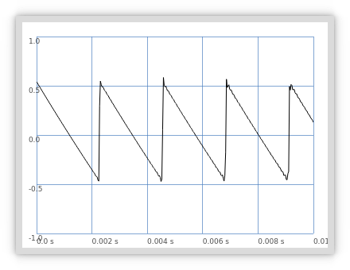

# Synthesis

## UGens (Unit Generators)

### Mouse Theremin
```supercollider
{SinOsc.ar(freq: MouseX.kr(300, 2500), mul: MouseY.kr(0, 1))}.play;
```
TODO: Animation with scope?
### Plotting

```supercollider
{SinOsc.ar}.plot;
```

```supercollider
{Saw.ar}.plot;
```

```supercollider
{Pulse.ar}.plot;
```

## Audio Rate and Control Rate
UGens are typically followed by the letters `.ar` and `.kr`. These stand for Audio Rate and Control Rate.

`SinOsc.ar` creates a unit generator that runs at the audio rate. If the computer is running at the common 
sampling rate of 44100 Hz, the sine oscillator will generate 44100 samples per second to send to the 
loudspeaker.

`SinOsc.kr` creates a unit generator that runs at the control rate. The job of generating the samples is
performed by the server. The amount of numbers generated per second with `.kr` is much smaller. The signal
generated with `.kr` does not go to the loudspeaker. Instead it is normally used to control the parameters of 
other signals -- for example, the `Mouse.kr` in the theremin was controlling the frequency of `SinOsc`.

❗UGens generate numbers. Some of these numbers become sound signals while others become control signals.

```supercollider
{SinOsc.ar(freq: SinOsc.kr * 200, mul: SinOsc.kr(200))}.play;
```

*Unipolar Ugens* generate numbers between 0 and 1.  
*Bipolar UGens* generate numbers between -1 and +1.

### `.poll` output
```supercollider
{SinOsc.kr(1).poll}.play;
```
This doesn't generate any sound.
```
-> Synth('temp__18' : 1000)
UGen(SinOsc): 0.00837747
UGen(SinOsc): 0.594541
UGen(SinOsc): 0.953611
UGen(SinOsc): 0.948435
UGen(SinOsc): 0.58099
UGen(SinOsc): -0.0083736
UGen(SinOsc): -0.594538
UGen(SinOsc): -0.95361
UGen(SinOsc): -0.948436
UGen(SinOsc): -0.580993
UGen(SinOsc): 0.00836973
```

## Scaling Ranges
### The `range` method
```supercollider
{SinOsc.ar(freq: LFNoise0.kr(5).range(500, 1500), mul: 0.1)}.play;
```
`LFNoise0` is a bipolar UGen. Scaling the output of `LFNoise0.kr` to set the frequency of `SinOsc.ar` allows it 
to be used for "hearable" frequencies.

### `mul` and `add` arguments
Most UGens have `mul` and `add` arguments.
```supercollider
{SinOsc.kr(1).range(100,200).poll}.play;
{SinOsc.kr(1, mul: 50, add: 150).poll}.play;
```
These produce the same result.  

### `linlin` and friends
`linlin` - Linear to linear.  
`linexp` - Linear to exponential.  
`explin` - Exponential to linear.  
`expexp` - Exponential to exponential.  

TODO: example
```supercollider
a = [1,2,3,4,5,6,7];
a.linexp(1,7,0.01,127).round(1);
```
```
-> [ 1, 2, 3, 4, 5, 6, 7 ]
-> [ 0.0, 0.0, 0.0, 1.0, 5.0, 26.0, 127 ]
```
TODO: How does it decide steps?
## Stopping Individual Synths with `free`
```supercollider
s.boot;

a = { Saw.ar(LFNoise2.kr(8).range(1000,2000), mul: 0.2) }.play;
b = { Saw.ar(LFNoise2.kr(7).range(100,1000), mul: 0.2) }.play;
c = { Saw.ar(LFNoise2.kr(15).range(2000,3000), mul: 0.2) }.play;

a.free;
b.free;
c.free;
```
## The `set` message
Allows changing synth parameters while the synth is still running.
```supercollider
x = {arg freq = 440, amp = 0.1; SinOsc.ar(freq, 0, amp)}.play;

x.set(\amp, 0.01);
x.set(\freq, 778);
x.set(\freq, 920, \amp, 0.1);
x.free;
```
## Audio Buses
Audio buses are used for routing audio signals. SuperCollider has 128 audio buses by default.  
  
Ctrl + M opens the Meter window. It shows the levels of all inputs and outputs. TODO: Screenshot in book doesn't match what I see?
## `Out` and `In` UGens
```supercollider
{Out.ar(1, SinOsc.ar(440, 0, 0.01))}.play;
{Out.ar(0, SinOsc.ar(440, 0, 0.01))}.play;
```
The `Out` UGen routes signals to specific buses. The first argument is the target bus, the second argument is the signal
that you want to send.  
```supercollider
// start the effect
f = {Out.ar(0, BPF.ar(in: In.ar(55), freq: MouseY.kr(1000,5000), rq: 0.1))}.play;
// start the source
n = {Out.ar(55, WhiteNoise.ar(0.5))}.play;
```
The first line declates a synth stored in variable `f` consisting of a Band Pass Filter UGen. A band pass filter
takes any sound as input and filters out all frequences except the region that you want to let through. `In.ar` is
the UGen we use to read from an audio bus; so with `In.ar(55)` being used as input of the `BPF`, any sound that we
send to bus 55 will be passed to the band pass filter.  
  
Note that the first synth does not make any sound at first. It will only make sound when the second line is
evaluated and we send some sound to bus 55. Noise synth -> Bus 55 -> Filter Synth.  
  
The order of execution is important. The example would not work if the lines were swapped.
## Microphone Input
```supercollider
// Takes sound from first input bus
{SoundIn.ar(0)}.play;
// Takes sound from first and second input bus
{SoundIn.ar([0,1])}.play;
// Reverb
{FreeVerb.ar(SoundIn.ar([0,1]), mix: 0.5, room: 0.9)}.play;
```
TODO: get working
## Multichannel Expansion
```supercollider
a = {FreeVerb.ar(in: Saw.ar(freq: [44, 20], mul: Saw.kr(freq: 15, mul: 10)), mix: 0.7, room: 1.2)}.play;
```
The `freq: [44, 20]` argument creates a sound in both speakers. A larger array of frequencies can be used to
send sound to other channels provided the sound card allows it.
```supercollider
a = {FreeVerb.ar(in: Saw.ar(freq: [15, 20], mul: [Saw.kr(freq: 50, mul: 10), Line.kr(0, 10, 20)]), mix: 0.7, room: 2)}.play;
```
Multichannel expansion with `freq` and `mul`. SuperCollider takes care of it.
```supercollider
s.boot;
a = {Out.ar(0, SinOsc.ar(freq: [400, 400], mul: LFPulse.ar(2)))}.play;
a.free;
```
Phone disconnected sound.
## The Bus object
TODO
## Panning
```supercollider
p = {Pan2.ar(in: PinkNoise.ar, pos: SinOsc.kr(2), level: 0.1)}.play;
```
Panning is the spreading of an audio signal into a stereo or multichannel sound field. This is a mono signal 
bounding right and left with `Pan2`.
```supercollider
(
x = {
    var lfn = LFNoise2.kr(1);
    var saw = Saw.ar(
        freq: 30,
        mul: LFPulse.kr(
            freq: LFNoise1.kr(1).range(1, 10),
            width: 0.1));
    var bpf = BPF.ar(in: saw, freq: lfn.range(500, 2500), rq: 0.01, mul: 20);
    Pan2.ar(in: bpf, pos: lfn);
}.play;
)
```
`lfn` is used to slide between randon numbers that it generates every second. It is used in two places in order to
select a random centre frequency between 500 and 2500 for the band pass filter, and to determine where the 
sound "lands" in `Pan2`. Because the same object is used, this causes the change in frequency to match the change in 
position. The centre frequency is defined as the midpoint between the two 3dB points of the band pass filter. 

The `mul` argument of `BPF` controls the "volume." The number 20 was used because the filter's sharpness means 
going too far below this value would cause the amplitude to drop too much.  

The rhythm is being controlled by the `mul` argument for `Saw`. TODO: explain more?
## Mix and Splay
```supercollider
// 5 channel output
a = {SinOsc.ar([100, 300, 500, 700, 900], mul: 0.1)}.play;
a.free;
// Mix down to mono
b = {Mix(SinOsc.ar([100, 300, 500, 700, 900], mul: 0.1))}.play;
b.free;
// Mix down to stereo
c = {Splay.ar(SinOsc.ar([100, 300, 500, 700, 900], mul: 0.1))}.play;
c.free;
```
`Mix` mixes an array of UGens into a single channel. `Splay` spreads an array of channels across a stereo field.
```supercollider
(
d = {
    arg fundamental = 110;
    var harmonics = [1,2,3,4,5,6,7,8,9];
    var snd = BPF.ar(
        in: Saw.ar(32, LFPulse.ar(harmonics, width: 0.1)),
        freq: harmonics * fundamental,
        rq: 0.01,
        mul: 20);
    Splay.ar(snd);
}.play;
)
d.set(\fundamental, 100);
```
The array `harmonics` has nine items, so the synth expands to nine channels. `Splay` takes the array of the nine
channels and mixes it down to stereo, spreading the channels evenly from left to right.
```supercollider
// Cluster generator
c = {Mix.fill(16, {SinOsc.ar(rrand(100, 3000), mul: 0.01)})}.play;
c.free;

(
n = { Mix.fill(12, {arg counter;
    var partial = counter + 1;
    SinOsc.ar(partial * 440, mul: 1 / partial.squared) * 0.1
})}.play;
FreqScope.new;
)
n.free;
```
`Mix.fill` takes the size of the array you want to create and a function in curly braces. Using this, it creates
an array of synths and mixes it down to mono all at once.
TODO why use?   
In the cluster generator example, `Mix.fill` evaluates the function 16 times. Sixteen sine waves are created with
a different frequency and are mixed down to mono then sent to the left channel.  
In the second example, twelve sine oscillators are generated following the harmonic series, and are mixed down
to a single note in mono. TODO single note?
## Audio Files
TODO
## Synth Nodes
TODO example + images
```supercollider
s.plotTree;

w = { SinOsc.ar(60.midicps, 0, 0.1) }.play;
x = { SinOsc.ar(64.midicps, 0, 0.1) }.play;
y = { SinOsc.ar(67.midicps, 0, 0.1) }.play;
z = { SinOsc.ar(71.midicps, 0, 0.1) }.play;

w.free;
x.free;
y.free;
z.free;
```
[](./plotTreeexample.png)
Rectangles in the node tree are synth nodes. Each synth gets a temporary name and stays there so long as it is
running.  
The shortcut Ctrl+. stops all the nodes that are running on the server. A synth may be running even if it is just
generating silence.

Using `doneAction: 2` means that the synth frees itself when it's done its job.
```supercollider
{WhiteNoise.ar{Line.kr(0.2, 0, 3)}}.play;
{WhiteNoise.ar{Line.kr(0.2, 0, 3, doneAction: 2)}}.play;
```
One item remains in the node tree while the other vanishes as soon as its corresponding sound stops.
## Envelopes 
### Percussive Envelopes and `Env.perc`
A percussive envelope is characterised by an abrupt onset followed by an immediate exponetial decay. This 
envelope can be created in SuperCollider with the `Env.perc` object.  

`Env.perc` takes four arguments: `attackTime`, `releaseTime`, `level`, and `curve`.

Plot created from `Env.perc.plot`.  

Plot created from `Env.perc(0.5).plot` which leades to an attack value of half a second.  

Plot created from `Env.perc(attackTime: 0.3, releaseTime: 2, level: 0.4).plot`.  

Plot created from `Env.perc(0.3, 2, 0.4, 0).plot`. The final argument means that the plot doesn't contain curves.  
### `Env.linen`
`Env.linen` describes a line envelope with attack, sustain, and release.
TODO: example
### `Env.pairs`
`Env.pairs` allows you to create envelopes of any shape and duration. TODO: how is this more "flexible"?
