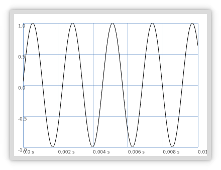
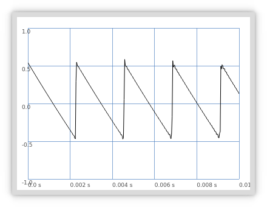
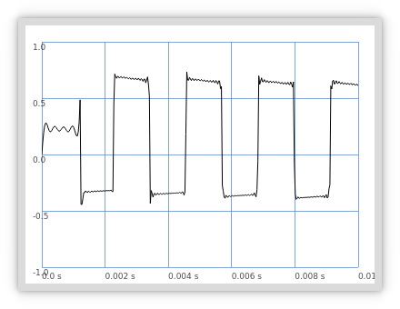

# Synthesis

## UGens (Unit Generators)

### Mouse Theremin
```supercollider
{SinOsc.ar(freq: MouseX.kr(300, 2500), mul: MouseY.kr(0, 1))}.play;
```
TODO: Animation with scope?
### Plotting

```supercollider
{SinOsc.ar}.plot;
```

```supercollider
{Saw.ar}.plot;
```

```supercollider
{Pulse.ar}.plot;
```

## Audio Rate and Control Rate
UGens are typically followed by the letters `.ar` and `.kr`. These stand for Audio Rate and Control Rate.

`SinOsc.ar` creates a unit generator that runs at the audio rate. If the computer is running at the common 
sampling rate of 44100 Hz, the sine oscillator will generate 44100 samples per second to send to the 
loudspeaker.

`SinOsc.kr` creates a unit generator that runs at the control rate. The job of generating the samples is
performed by the server. The amount of numbers generated per second with `.kr` is much smaller. The signal
generated with `.kr` does not go to the loudspeaker. Instead it is normally used to control the parameters of 
other signals -- for example, the `Mouse.kr` in the theremin was controlling the frequency of `SinOsc`.

❗UGens generate numbers. Some of these numbers become sound signals while others become control signals.

```supercollider
{SinOsc.ar(freq: SinOsc.kr * 200, mul: SinOsc.kr(200))}.play;
```

*Unipolar Ugens* generate numbers between 0 and 1.
*Bipolar UGens* generate numbers between -1 and +1.

TODO: Poll method

## Scaling Ranges
